# Практическое занятие №3 (19). Логирование с помощью logrus. Ведение структурированных логов

## Выполнил: Туев Д. ЭФМО-01-25

## Содержание

1. [Описание проекта](#описание-проекта)
2. [Границы сервисов](#границы-сервисов)
3. [Архитектура решения](#архитектура-решения)
4. [Стандарт логов](#стандарт-логов)
5. [Реализация](#реализация)
6. [API спецификация](#api-спецификация)
7. [Запуск сервисов](#запуск-сервисов)
8. [Тестирование](#тестирование)
9. [Скриншоты выполнения](#скриншоты-выполнения)
10. [Примеры логов](#примеры-логов)
11. [Выводы](#выводы)
12. [Контрольные вопросы](#контрольные-вопросы)

---

## Описание проекта

Проект представляет собой систему из двух микросервисов с внедрённым структурированным логированием на базе библиотеки **logrus**:

- **Auth service** — gRPC сервер для проверки токенов (порт 50051)
- **Tasks service** — HTTP REST API для работы с задачами (порт 8082), который при каждом запросе вызывает Auth service по gRPC

**Цель работы:** Научиться внедрять структурированные логи в микросервисы, настроить единый стандарт логирования, обеспечить сквозную трассировку через request-id и корректное логирование ошибок.

---

## Границы сервисов

| Сервис | Зона ответственности | Интерфейс |
|--------|----------------------|-----------|
| **Auth service** | Проверка токенов (фиксированный токен `demo-token`) | gRPC (порт 50051) |
| **Tasks service** | CRUD задач, проверка доступа перед операциями | HTTP REST API (порт 8082) + gRPC клиент к Auth |

---

## Архитектура решения

### Схема взаимодействия с логированием

```
[Клиент] 
    │ 
    │ HTTP/JSON (порт 8082) с X-Request-ID
    ▼
[Tasks service] 
    │ ● Логирует входящий запрос (method, path, request-id)
    │ ● Создаёт запись "request started" (DEBUG)
    │
    │ gRPC вызов Verify с прокидыванием request-id в metadata
    ▼
[Auth service] 
    │ ● Извлекает request-id из metadata
    │ ● Логирует проверку токена
    │
    ▼
[Возврат результата] → Логи "request completed" с duration_ms
```

### Детализация логирования

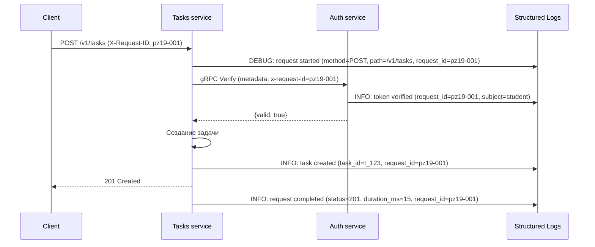

---

## Стандарт логов

### Обязательные поля для всех логов

| Поле | Описание | Пример |
|------|----------|--------|
| `level` | Уровень логирования | `info`, `warn`, `error`, `debug` |
| `ts` | Временная метка (RFC3339Nano) | `2026-02-22T20:30:45.123456789+03:00` |
| `service` | Имя сервиса | `auth`, `tasks` |
| `request_id` | Идентификатор запроса (сквозной) | `pz19-001` |

### Поля для access log (запрос завершён)

| Поле | Описание |
|------|----------|
| `method` | HTTP метод |
| `path` | Путь запроса |
| `status` | Код ответа |
| `duration_ms` | Время обработки в миллисекундах |
| `remote_ip` | IP клиента |
| `user_agent` | User-Agent |

### Поля для ошибок

| Поле | Описание |
|------|----------|
| `error` | Текст ошибки (без секретов) |
| `component` | Компонент, где произошла ошибка |

### Уровни логирования

- **DEBUG** — детальная информация для отладки (начало запроса, вызовы)
- **INFO** — успешные операции, завершённые запросы
- **WARN** — подозрительные ситуации (неверный токен, 404)
- **ERROR** — ошибки, требующие внимания (недоступность сервисов)

---

## Реализация

### Структура shared/logger

**`shared/logger/logger.go`** — инициализация структурированного логгера:

- Настройка JSON формата
- Добавление поля `service` во все логи
- Конфигурация уровня логирования через `LOG_LEVEL`

### Middleware

**`shared/middleware/requestid.go`** — извлечение/генерация request-id:
- Читает `X-Request-ID` из заголовка
- Если нет — генерирует новый UUID
- Сохраняет в контекст и добавляет в ответ

**`shared/middleware/logging.go`** — логирование HTTP запросов:
- Логирует начало запроса (DEBUG)
- Логирует завершение запроса (INFO) со всеми полями
- Использует request-id из контекста

### Прокидывание request-id в gRPC

**`services/tasks/internal/client/authclient/client.go`**:
- Извлекает request-id из контекста через `middleware.GetRequestID()`
- Добавляет его в исходящие gRPC метаданные

**`services/auth/internal/grpc/server.go`**:
- Извлекает request-id из входящих метаданных
- Добавляет его в логи

---

## API спецификация

### Auth service (gRPC)

**Метод:** `auth.AuthService.Verify`

**Request:**
```json
{
  "token": "demo-token"
}
```

**Response (успех):**
```json
{
  "valid": true,
  "subject": "student"
}
```

---

### Tasks service (HTTP REST API)

Базовый URL: `http://localhost:8082`

Все запросы требуют заголовок `Authorization: Bearer <token>`.

#### `POST /v1/tasks` — создание задачи

**Request:**
```json
{
    "title": "Изучить логирование",
    "description": "Практическое занятие 19",
    "due_date": "2026-03-01"
}
```

**Response 201:**
```json
{
    "id": "t_1234567890",
    "title": "Изучить логирование",
    "description": "Практическое занятие 19",
    "due_date": "2026-03-01",
    "done": false
}
```

#### `GET /v1/tasks` — список задач

**Response 200:** массив задач

#### `GET /v1/tasks/{id}` — получить задачу

**Response 200:** объект задачи
**Response 404:** `{"error":"task not found"}`

#### `PATCH /v1/tasks/{id}` — обновить задачу

**Request:**
```json
{
    "title": "Обновлённый заголовок",
    "done": true
}
```

**Response 200:** обновлённая задача

#### `DELETE /v1/tasks/{id}` — удалить задачу

**Response 204** (без тела)

### Ошибки Tasks service

| Код | Описание | Тело ответа |
|-----|----------|-------------|
| 400 | Неверный формат запроса | `{"error":"invalid request body"}` |
| 400 | Отсутствует title | `{"error":"title is required"}` |
| 401 | Отсутствует Authorization | `{"error":"missing authorization header"}` |
| 401 | Неверный токен | `{"error":"invalid token"}` |
| 503 | Auth service недоступен | `{"error":"authentication service unavailable"}` |
| 404 | Задача не найдена | `{"error":"task not found"}` |

---

## Запуск сервисов

### Переменные окружения

**Auth service:**
- `AUTH_GRPC_PORT` — gRPC порт (по умолчанию 50051)
- `LOG_LEVEL` — уровень логирования (debug/info/warn/error)

**Tasks service:**
- `TASKS_PORT` — HTTP порт (по умолчанию 8082)
- `AUTH_GRPC_ADDR` — адрес gRPC сервера Auth (по умолчанию `localhost:50051`)
- `LOG_LEVEL` — уровень логирования (debug/info/warn/error)

### Команды для запуска

#### Терминал 1 (Auth service)

```bash
cd services/auth
export AUTH_GRPC_PORT=50051
export LOG_LEVEL=debug
go run ./cmd/auth
```

#### Терминал 2 (Tasks service)

```bash
cd services/tasks
export TASKS_PORT=8082
export AUTH_GRPC_ADDR=localhost:50051
export LOG_LEVEL=debug
go run ./cmd/tasks
```

---

## Тестирование

### 1. Создание задачи с указанным request-id

```bash
curl -i -X POST http://localhost:8082/v1/tasks \
  -H "Content-Type: application/json" \
  -H "Authorization: Bearer demo-token" \
  -H "X-Request-ID: pz19-test-001" \
  -d '{"title":"Тест логирования","description":"Проверка структурированных логов"}'
```

### 2. Получение списка задач

```bash
curl -i -X GET http://localhost:8082/v1/tasks \
  -H "Authorization: Bearer demo-token" \
  -H "X-Request-ID: pz19-test-002"
```

### 3. Попытка с неверным токеном

```bash
curl -i -X GET http://localhost:8082/v1/tasks \
  -H "Authorization: Bearer wrong-token" \
  -H "X-Request-ID: pz19-test-003"
```

### 4. Проверка таймаута (остановите Auth)

```bash
# Остановите Auth (Ctrl+C), затем выполните:
curl -i -X GET http://localhost:8082/v1/tasks \
  -H "Authorization: Bearer demo-token" \
  -H "X-Request-ID: pz19-test-004"
```

---

## Скриншоты выполнения

### 1. Запуск Auth service с логированием

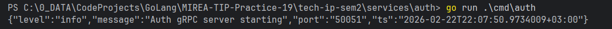

### 2. Запуск Tasks service с логированием

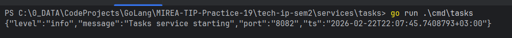

### 3. Успешное создание задачи (клиент)

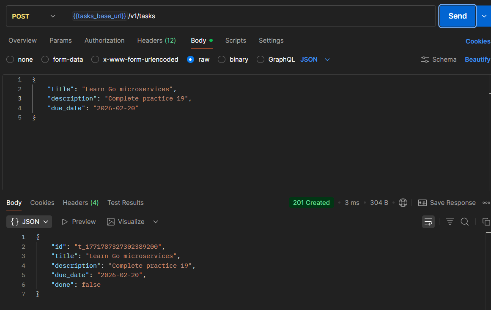

### 4. Логи Tasks service при создании задачи

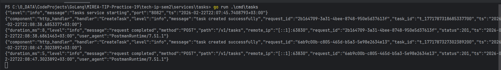

### 5. Логи Auth service при проверке токена

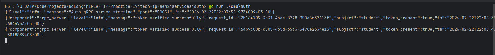

### 6. Ошибка при неверном токене

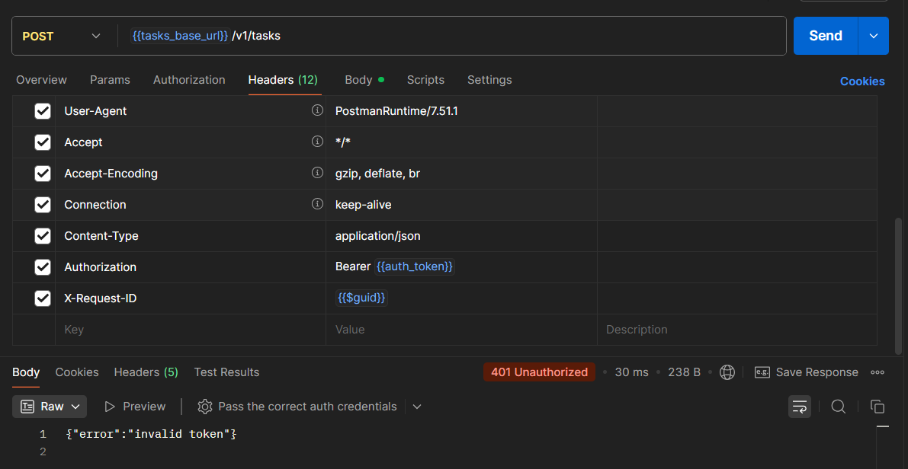

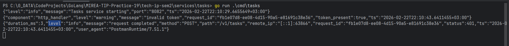

### 7. Таймаут при недоступном Auth service

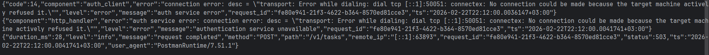

### 8. Получение списка задач

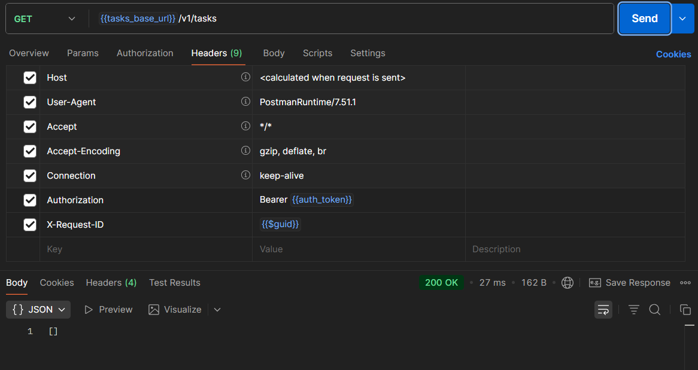

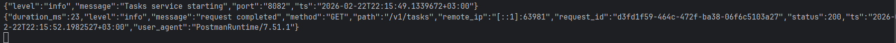

### 9. Удаление задачи

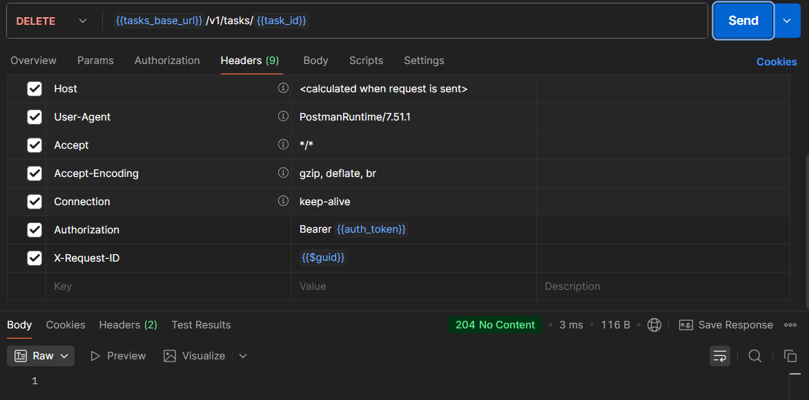

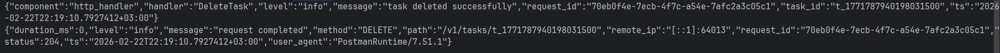

---

## Примеры логов

### Успешный запрос (Tasks service)

```json
{
  "level": "info",
  "ts": "2026-02-22T20:30:45.123456789+03:00",
  "service": "tasks",
  "method": "POST",
  "path": "/v1/tasks",
  "status": 201,
  "duration_ms": 15,
  "remote_ip": "127.0.0.1:54321",
  "user_agent": "curl/7.68.0",
  "request_id": "pz19-test-001",
  "message": "request completed"
}
```

### Создание задачи (Tasks service)

```json
{
  "level": "info",
  "ts": "2026-02-22T20:30:45.123456789+03:00",
  "service": "tasks",
  "component": "http_handler",
  "handler": "CreateTask",
  "task_id": "t_1234567890",
  "request_id": "pz19-test-001",
  "message": "task created successfully"
}
```

### Проверка токена (Auth service)

```json
{
  "level": "info",
  "ts": "2026-02-22T20:30:45.123456789+03:00",
  "service": "auth",
  "component": "grpc_server",
  "subject": "student",
  "request_id": "pz19-test-001",
  "message": "token verified successfully"
}
```

### Ошибка при неверном токене (Tasks service)

```json
{
  "level": "warn",
  "ts": "2026-02-22T20:31:45.123456789+03:00",
  "service": "tasks",
  "component": "http_handler",
  "token_present": true,
  "request_id": "pz19-test-003",
  "message": "invalid token"
}
```

### Таймаут (Tasks service)

```json
{
  "level": "error",
  "ts": "2026-02-22T20:32:45.123456789+03:00",
  "service": "tasks",
  "component": "auth_client",
  "error": "auth service timeout",
  "request_id": "pz19-test-004",
  "message": "auth service timeout"
}
```

---

## Выводы

В ходе выполнения практического занятия №19 были достигнуты следующие результаты:

1. **Выбран и внедрён структурированный логгер** — использована библиотека `logrus` с выводом в JSON-формате.

2. **Разработан единый стандарт логов** — определены обязательные поля (`level`, `ts`, `service`, `request_id`) и дополнительные поля для разных типов событий.

3. **Реализовано middleware для логирования HTTP запросов**:
   - Логирование начала запроса (DEBUG)
   - Логирование завершения запроса (INFO) с duration_ms
   - Корректный захват статус-кода через обёртку ResponseWriter

4. **Обеспечена сквозная трассировка**:
   - Request-id извлекается/генерируется в middleware
   - Прокидывается в контекст запроса
   - Передаётся в gRPC вызовы через метаданные
   - Логируется во всех сервисах

5. **Реализовано логирование ошибок с контекстом**:
   - Ошибки логируются подробно на сервере
   - Чувствительные данные (токены) не попадают в логи
   - Клиент получает безопасные сообщения об ошибках

6. **Настроены уровни логирования**:
   - DEBUG — детальная информация для отладки
   - INFO — успешные операции
   - WARN — подозрительные ситуации
   - ERROR — критические ошибки

Таким образом, система приобрела промышленный уровень наблюдаемости (observability), позволяющий эффективно диагностировать проблемы в распределённой среде.

---

## Контрольные вопросы

### 1. Почему структурированные логи удобнее строковых?

Структурированные логи (JSON) удобнее строковых, потому что:
- **Машиночитаемы** — легко парсятся и индексируются системами сбора логов (ELK, Loki, Splunk)
- **Фильтруемы** — можно искать по конкретным полям (`level=error`, `service=auth`)
- **Расширяемы** — добавление нового поля не ломает существующие парсеры
- **Контекстны** — каждое событие содержит все необходимые атрибуты
- **Агрегируемы** — можно строить метрики и дашборды на основе полей

### 2. Что такое request-id и как он помогает при диагностике?

Request-id (или correlation id) — это уникальный идентификатор, присваиваемый каждому входящему запросу и прокидываемый через все сервисы, участвующие в обработке.

**Помощь при диагностике:**
- Позволяет связать логи разных сервисов, обрабатывающих один запрос
- Упрощает поиск всех событий, относящихся к конкретной ошибке
- Даёт возможность измерить полное время обработки запроса через все сервисы
- Помогает восстанавливать последовательность действий при отладке

### 3. Какие поля вы считаете обязательными для access log?

Обязательные поля для access log:
- **timestamp** — время события
- **request_id** — для трассировки
- **method** — HTTP метод
- **path** — запрашиваемый ресурс
- **status** — код ответа
- **duration_ms** — время обработки
- **remote_ip** — IP клиента (для безопасности)
- **user_agent** — для аналитики

### 4. Почему нельзя писать токены и пароли в логи?

Запрет на логирование чувствительных данных обусловлен:
- **Безопасностью** — логи могут храниться долго и доступны многим инженерам
- **Соответствием стандартам** — GDPR, PCI DSS, HIPAA требуют защиты личных данных
- **Предотвращением утечек** — пароли в логах могут быть случайно опубликованы
- **Юридическими рисками** — утечка данных ведёт к штрафам

Вместо значений логируйте факты: `"auth_header_present": true`, `"token_valid": false`

### 5. Что логировать в ERROR, а что в INFO/WARN?

**INFO:**
- Успешное создание/обновление/удаление ресурса
- Завершённые запросы (access log)
- Запуск/остановка сервиса
- Изменение конфигурации

**WARN:**
- Неверный токен (ожидаемая ошибка авторизации)
- Запрос к несуществующему ресурсу (404)
- Невалидные входные данные от клиента
- Первый признак проблемы (например, увеличение времени ответа)

**ERROR:**
- Недоступность зависимых сервисов (Auth timeout)
- Ошибки базы данных
- Внутренние ошибки сервера (500)
- Ситуации, требующие вмешательства администратора

---
